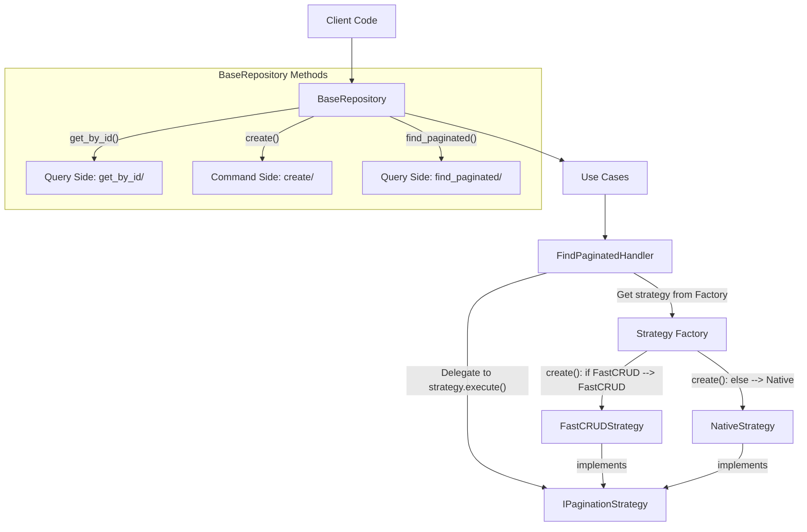
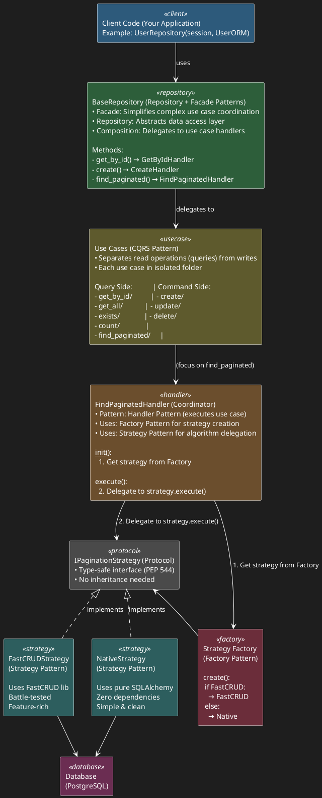

# Architecture: Design Patterns & Interactions

## Overview

This library combines multiple design patterns to create a flexible, maintainable, and type-safe repository implementation. Each pattern addresses a specific architectural challenge.

---

## 📊 Pattern Stack (Visual)

### High Level Overview



### Detailed Level



---

## 🎯 Patterns Used & Why

### 1. **Repository Pattern**

**Where:** `base.py`, `interfaces.py`

**Purpose:** Abstract data access layer from business logic

**Problem It Solves:**
- ❌ Direct SQLAlchemy usage leaks infrastructure details
- ❌ Hard to test (requires real database)
- ❌ Hard to swap ORMs

**How We Use It:**
```python
# Clean interface - no SQLAlchemy leaking
class IRepository(Protocol[T]):
    async def get_by_id(self, entity_id: Any) -> Optional[T]: ...
    async def create(self, entity: T) -> T: ...

# Implementation hides SQLAlchemy
class BaseRepository(IRepository[T]):
    def __init__(self, db_session: AsyncSession, model_class: Type[T]):
        self.db = db_session  # ✅ Hidden from caller
```

**Alternatives Rejected:**
- ❌ Active Record (mixes domain + persistence)
- ❌ Direct DAO (too low-level)

**Rating: Essential - 100/100**

---

### 2. **CQRS Pattern (Command Query Responsibility Segregation)**

**Where:** `use_cases/` folder structure

**Purpose:** Separate read operations from write operations

**Problem It Solves:**
- ❌ Mixed CRUD operations violate Single Responsibility Principle
- ❌ Read optimizations affect writes (and vice versa)
- ❌ Hard to scale reads vs writes differently

**How We Use It:**
```
use_cases/
├── get_by_id/       # Query (read)
│   ├── query_handler.py
│   └── query_model.py
├── create/          # Command (write)
│   ├── command_handler.py
│   └── command_model.py
└── find_paginated/  # Query (read, complex)
    ├── query_handler.py
    └── query_model.py
```

**Benefits:**
- ✅ Queries can't accidentally modify data
- ✅ Commands have clear side effects
- ✅ Easy to optimize each independently
- ✅ Matches GridFlow conventions

**Alternatives Rejected:**
- ❌ Single CRUD class (violates SRP)
- ❌ Service layer (too generic)

**Rating: Essential (GridFlow convention) - 95/100**

---

### 3. **Strategy Pattern**

**Where:** `pagination/strategies/`

**Purpose:** Swap pagination algorithms at runtime

**Problem It Solves:**
- ❌ Hard-coded FastCRUD usage → lock-in
- ❌ If FastCRUD unavailable → system breaks
- ❌ Can't test pagination without external dependency

**How We Use It:**
```python
# Define interface
class IPaginationStrategy(Protocol):
    async def execute(...) -> PaginatedResult: ...

# Multiple implementations
class FastCRUDStrategy:  # Battle-tested, feature-rich
    async def execute(...): ...

class NativeStrategy:    # Zero dependencies, fallback
    async def execute(...): ...

# Client code doesn't know which is used
handler.strategy.execute(...)  # ✅ Polymorphic
```

**Benefits:**
- ✅ Can swap backends without changing client code
- ✅ Easy to add new strategies (Open/Closed Principle)
- ✅ Testable (mock strategy interface)

**Alternatives Rejected:**
- ❌ If/else in repository (violates OCP, not testable)
- ❌ Template Method (requires inheritance)

**Rating: Essential for flexibility - 95/100**

---

### 4. **Factory Pattern**

**Where:** `use_cases/find_paginated/strategy_factory.py`

**Purpose:** Encapsulate strategy creation logic

**Problem It Solves:**
- ❌ Strategy selection logic scattered across codebase
- ❌ Hard to test (need to mock `has_fastcrud()` everywhere)
- ❌ Violates Single Responsibility (handler shouldn't know how to create strategies)

**How We Use It:**
```python
class PaginationStrategyFactory:
    @staticmethod
    def create() -> IPaginationStrategy:
        if has_fastcrud():
            return FastCRUDStrategy()
        return NativeStrategy()

# Usage
handler.strategy = PaginationStrategyFactory.create()  # ✅ One place
```

**Benefits:**
- ✅ Centralized creation logic
- ✅ Easy to test (mock factory)
- ✅ Single Responsibility (handler focuses on coordination)

**Before Factory (Implicit):**
```python
# ❌ Factory logic buried in handler
def _select_strategy(self):
    if has_fastcrud():
        return FastCRUDStrategy()
    return NativeStrategy()
```

**Rating: Essential for testability - 90/100**

---

### 5. **Protocol Pattern (PEP 544)**

**Where:** `pagination/strategies/base.py`

**Purpose:** Define type-safe interfaces without inheritance

**Problem It Solves:**
- ❌ ABC requires inheritance (rigid, not Pythonic)
- ❌ No type safety → runtime errors
- ❌ IDE autocomplete doesn't work

**How We Use It:**
```python
from typing import Protocol

class IPaginationStrategy(Protocol):
    """Structural subtyping - no inheritance needed."""
    async def execute(...) -> PaginatedResult: ...

# Implementation doesn't inherit
class FastCRUDStrategy:  # ✅ Just implements the interface
    async def execute(...) -> PaginatedResult: ...

# Type checker validates
def use_strategy(strategy: IPaginationStrategy):  # ✅ Type-safe
    await strategy.execute(...)
```

**Benefits:**
- ✅ Duck typing with type safety
- ✅ No inheritance coupling
- ✅ IDE autocomplete works
- ✅ Pythonic (PEP 544 standard)

**Alternatives Rejected:**
- ❌ ABC (requires inheritance, too rigid)
- ❌ No types (runtime errors, no IDE support)

**Rating: Modern best practice - 90/100**

---

### 6. **Composition Pattern**

**Where:** `base.py` (handler composition)

**Purpose:** Build complex behavior from simple components

**Problem It Solves:**
- ❌ 100+ line monolithic repository class
- ❌ Mixed responsibilities (violates SRP)
- ❌ Hard to test individual operations

**How We Use It:**
```python
class BaseRepository:
    def __init__(self, db_session, model_class):
        # ✅ Compose handlers (composition over inheritance)
        self._get_by_id = GetByIdHandler(db_session, model_class)
        self._create = CreateHandler(db_session)
        self._find_paginated = FindPaginatedHandler(db_session, model_class)

    async def get_by_id(self, id):
        return await self._get_by_id.execute(id)  # ✅ Delegate
```

**Benefits:**
- ✅ Each file < 100 lines (enforced rule)
- ✅ Easy to test handlers independently
- ✅ Composition over inheritance (flexible)

**Rating: Essential for file size rule - 90/100**

---

## ⚖️ Pattern Trade-offs

| Pattern | Complexity Added | Value Added | Keep? |
|---------|------------------|-------------|-------|
| Repository | Low | High (abstracts DB) | ✅ Yes |
| CQRS | Medium | High (SRP, GridFlow) | ✅ Yes |
| Strategy | Medium | High (flexibility) | ✅ Yes |
| Factory | Low | High (testability) | ✅ Yes |
| Protocol | Low | Medium (type safety) | ✅ Yes |
| Composition | Low | High (file size rule) | ✅ Yes |

**Total Patterns: 6**
**Assessment: ✅ All justified, stop adding more**

---

## 🔄 Pattern Interaction Flow

**Example: `repo.find_paginated(page=1, filters=[...])`**

```
1. Client calls BaseRepository.find_paginated()
   └─ Pattern: Repository (abstracts DB)

2. BaseRepository delegates to FindPaginatedHandler
   └─ Pattern: Composition (handler delegation)

3. FindPaginatedHandler.__init__() calls PaginationStrategyFactory.create()
   └─ Pattern: Factory (creates strategy)

4. Factory checks has_fastcrud() and returns strategy
   └─ Pattern: Factory (encapsulates creation)

5. Handler calls strategy.execute()
   └─ Pattern: Strategy (algorithm delegation)

6. FastCRUDStrategy or NativeStrategy executes query
   └─ Pattern: Strategy (polymorphic behavior)

7. Handler returns PaginatedResult to client
   └─ Pattern: Repository (consistent interface)
```

---

## 🚫 Anti-Patterns Avoided

### ❌ God Object
**Avoided by:** CQRS + Composition (split into handlers)

### ❌ Hard-coded Dependencies
**Avoided by:** Strategy + Factory (runtime selection)

### ❌ Leaky Abstraction
**Avoided by:** Repository (hides SQLAlchemy)

### ❌ Tight Coupling
**Avoided by:** Protocol (interface, not inheritance)

### ❌ Mixed Responsibilities
**Avoided by:** CQRS (separate read/write)

---

## 📚 Further Reading

- **Repository Pattern:** [Martin Fowler - P of EAA](https://martinfowler.com/eaaCatalog/repository.html)
- **CQRS:** [Martin Fowler - CQRS](https://martinfowler.com/bliki/CQRS.html)
- **Strategy Pattern:** [Refactoring Guru](https://refactoring.guru/design-patterns/strategy)
- **Protocol (PEP 544):** [Python PEP 544](https://peps.python.org/pep-0544/)

---

## 🎓 When to Add New Patterns

**✅ Add a pattern if:**
- Solves a specific, recurring problem
- Reduces code duplication significantly
- Makes testing easier
- Follows established best practices

**❌ Don't add a pattern if:**
- Just for pattern's sake
- Adds complexity without clear benefit
- Duplicates existing pattern's role
- Not documented/understood by team

**Current Status:** ⚠️ **STOP** - Library at optimal pattern count (6/6)
